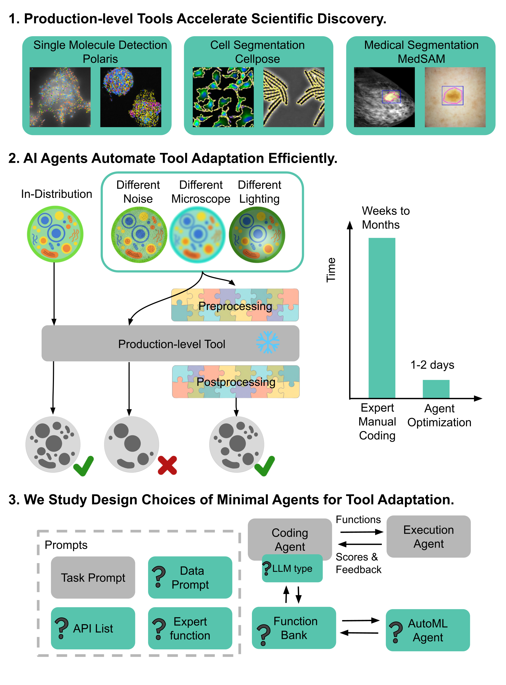

<div align="center">

# Simple Agents Outperform Experts in Biomedical Imaging Workflow Optimization

**CVPR 2026**

**[Paper (arXiv)](https://arxiv.org/abs/2512.06006)** &nbsp;|&nbsp; **[Project Page](https://xuefei-wang.github.io/simple-agent-opt/)**

Xuefei (Julie) Wang, Kai A. Horstmann, Ethan Lin, Jonathan Chen, Alexander R. Farhang, Sophia Stiles,<br>
Atharva Sehgal, Jonathan Light, David Van Valen, Yisong Yue, Jennifer J. Sun

*Caltech &middot; Cornell &middot; UT Austin &middot; RPI*

</div>

<p align="center">
  
</p>

AI agents (AutoGen + GPT-4.1/o3/Llama 3.3-70B) autonomously write and iteratively optimize preprocessing/postprocessing code for scientific image analysis. A **function bank** accumulates all generated solutions with metrics, feeding the best and worst back into prompts to guide exploration. Simple agent designs consistently outperform human-expert baselines across three production-level biomedical imaging tasks.

## Key Results

| Task | Tool | Metric | Expert | Agent (best) |
|:-----|:-----|:-------|-------:|-------------:|
| Spot detection | Polaris / DeepCell | F1 | 0.841 | **> 0.841** |
| Cell segmentation | Cellpose 3 (cyto3) | AP @ IoU 0.5 | 0.402 | **> 0.402** |
| Medical segmentation | MedSAM | NSD + DSC | 0.820 | **> 0.820** |

---

## Getting Started

### 1. Install

```bash
# Install uv if needed: curl -LsSf https://astral.sh/uv/install.sh | sh
uv venv && source .venv/bin/activate

# Pick the extra for your task:
uv pip install -e ".[cellpose]"    # Cell segmentation
uv pip install -e ".[polaris]"     # Spot detection
uv pip install -e ".[medsam]"      # Medical segmentation
uv pip install -e ".[dev]"         # Development / tests
```

<details>
<summary>Using pip instead of uv</summary>

```bash
python -m venv .venv && source .venv/bin/activate
pip install -e ".[cellpose]"  # or .[polaris], .[medsam]
```
</details>

### 2. Configure API keys

```bash
export OPENAI_API_KEY="sk-..."
# Task-specific:
export DEEPCELL_ACCESS_TOKEN="..."   # Polaris only
```

### 3. Run

```bash
python main.py \
    --dataset /path/to/data \
    --experiment_name cellpose_segmentation \
    --gpu_id 0 \
    --random_seed 42 \
    -k 3 \
    --num_optim_iter 20 \
    --history_threshold 5
```

Results are saved to `{experiment_name}/{timestamp}/preprocessing_func_bank.json`.

---

## Reproducing Paper Results

1. **Download data** — see data utilities in `utils/` (`cellpose_data.py`, `spotdetection_data.py`, `medsam_data.py`).

2. **Task-specific setup**:
   - **MedSAM** — download `medsam_vit_b.pth` ([instructions](https://github.com/bowang-lab/MedSAM?tab=readme-ov-file#installation)) and pass `--checkpoint_path`.
   - **Polaris** — set `DEEPCELL_ACCESS_TOKEN` ([instructions](https://deepcell.readthedocs.io/en/master/API-key.html)).
   - **Cellpose** — comment out `fill_holes_and_remove_small_masks` in `dynamics.resize_and_compute_masks`.

3. **Run experiments** with appropriate `--experiment_name` (`spot_detection`, `cellpose_segmentation`, or `medSAM_segmentation`).

4. **Analyze trajectories**:
   ```bash
   python figs/{task_name}_analyze_trajectories.py --data_path /path/to/data
   ```
   Creates `analysis_results/` under each result folder with test-set evaluations and plots.

---

## Adding Your Own Task

Integrate a custom scientific workflow by implementing four components:

| Component | File | What to implement |
|:----------|:-----|:------------------|
| Tool wrapper | `src/{task}.py` | `__init__()`, `predict()`, `evaluate()` |
| Prompts | `prompts/{task}_prompts.py` | Inherit `TaskPrompts`; implement `get_template_replacements()`, `get_task_details()`, `get_pipeline_metrics_info()` |
| Expert baseline | `prompts/{task}_expert_postprocessing.py.txt` | Reference solution for comparison |
| Registry entry | `main.py` → `TASK_CONFIGS` | Prompt class, sampling function, extra kwargs |

See **[docs/adding_a_task.md](docs/adding_a_task.md)** for a full walkthrough.

---

## CLI Reference

<details>
<summary><b>All arguments</b></summary>

**Core:**

| Flag | Default | Description |
|:-----|:--------|:------------|
| `--dataset` / `-d` | — | Path to dataset |
| `--experiment_name` | — | Task name (e.g. `cellpose_segmentation`) |
| `--checkpoint_path` | — | Model checkpoint (MedSAM only) |
| `--gpu_id` | `0` | GPU device ID |
| `--random_seed` | `42` | Random seed |
| `--num_optim_iter` | `20` | Total optimization iterations |
| `--llm_model` | `gpt-4.1` | LLM to use |
| `--max_round` | `20` | Max conversation rounds per iteration |
| `--cache_seed` | `4` | AutoGen cache seed |
| `-k` | `3` | Function pairs per iteration |

**Function bank:**

| Flag | Default | Description |
|:-----|:--------|:------------|
| `--n_top` | `3` | Top-performing functions shown in prompt |
| `--n_worst` | `3` | Worst-performing functions shown in prompt |
| `--n_last` | `0` | Most recent functions shown in prompt |
| `--history_threshold` | `0` | Iterations before including function bank history |

**AutoML (Optuna):**

| Flag | Default | Description |
|:-----|:--------|:------------|
| `--hyper_optimize` | off | Enable hyperparameter search |
| `--n_hyper_optimize` | `3` | Functions to optimize |
| `--n_hyper_optimize_trials` | `24` | Optuna trials per function |
| `--hyper_optimize_interval` | `5` | Run AutoML every N iterations |
</details>

---

## Tests

```bash
# Unit tests (no GPU/data required)
python -m pytest tests/ -v

# Integration tests (require data + task packages)
python -m tests.test_cellpose_segmentation --data_path /path/to/data
python -m tests.test_spotdetection
python -m tests.test_medsam_segmentation
```

---

## Citation

```bibtex
@inproceedings{wang2026simple,
  title={Simple Agents Outperform Experts in Biomedical Imaging Workflow Optimization},
  author={Wang, Xuefei and Horstmann, Kai A. and Lin, Ethan and Chen, Jonathan and Farhang, Alexander R. and Stiles, Sophia and Sehgal, Atharva and Light, Jonathan and Van Valen, David and Yue, Yisong and Sun, Jennifer J.},
  booktitle={Proceedings of the IEEE/CVF Conference on Computer Vision and Pattern Recognition (CVPR)},
  year={2026}
}
```

## License

Apache License 2.0
